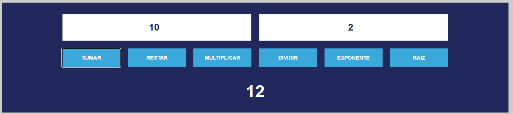

# Proyecto: Calculadora Web en JavaScript

## Descripción
Este proyecto es el template para hacer una **calculadora web básica** desarrollada con **HTML, CSS y JavaScript**.  
Actualmente solo tiene el HTML y el disño en CSS, y tu tarea será **realizar las funciones restantes**.

El proyecto forma parte de la práctica del curso de *Desarrollo Web*, donde aplicaremos conceptos de:
- Variables y funciones en JavaScript  
- Manipulación del DOM  
- Eventos y manejo de formularios  
- Validación de entradas del usuario  

## Explicación de conceptos

Let: se utiliza para declarar variables.

Window.onload: asegura que la pantalla de la calculadora este vacía al inicio.

ButtonInput.forEach: es un indicador para que cada botón de la calculadora, realice una acción.

ButtonClass.addEventListener: es un escuchador para cuando se hace click sobre un botón ocurra un evento.

Expression = inputValue

.replaceAll: convierte los símbolos.

Result = eval(expression): evalúa la expresión matemática.

Number.isInteger(result) ? result : result.toFixed(2): si un número es decimal, lo redondea a 2 decimales.

Number.isNaN(result) || !Number.isFinite(result): verifica si el resultado no es un número o es infinito.
---

## 🚀 Instrucciones

1. **Clona** este repositorio en tu computadora:
   ```bash
   git clone https://github.com/IDAI-NE-MA2025/richard-calculadora.git

---

## 🚀 Ejemplo de Suma


En la imagen anterior, podemos ver como de lado izquierdo se debe de escribir un numero y del lado derecho se colocará el otro numero.
El usuario podra dar click a un botón y mostrará el resultado. Actualmente se muestra en la página web, pero si lo muestran con un alert, lo doy por bien.
